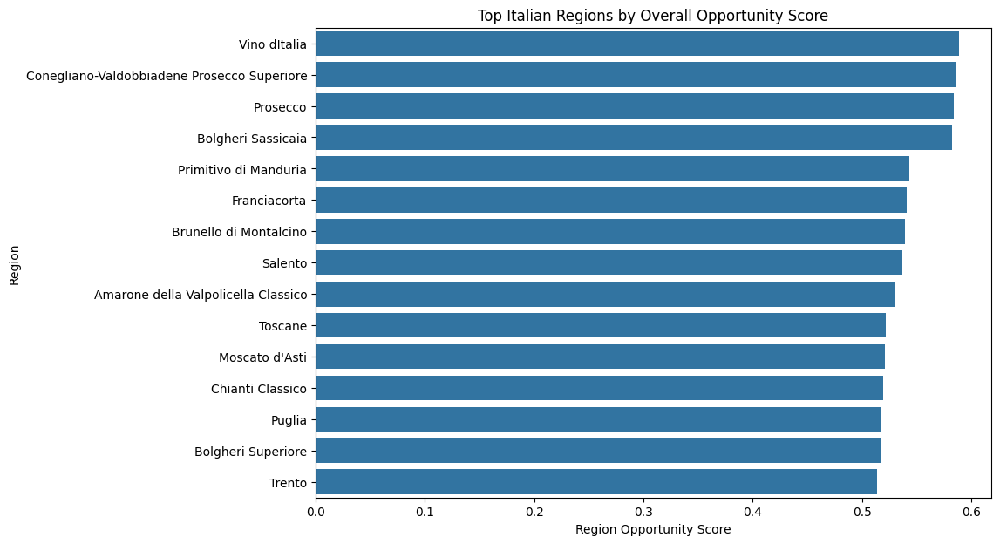
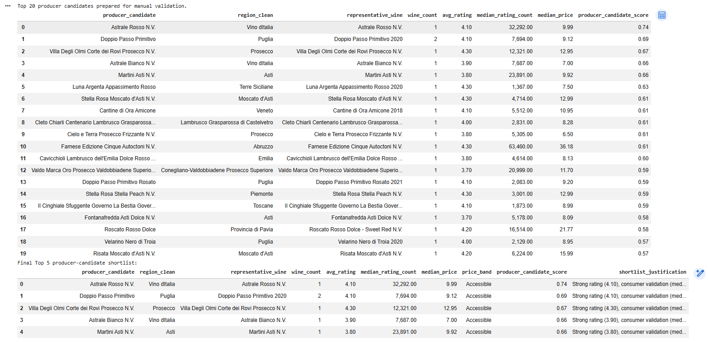
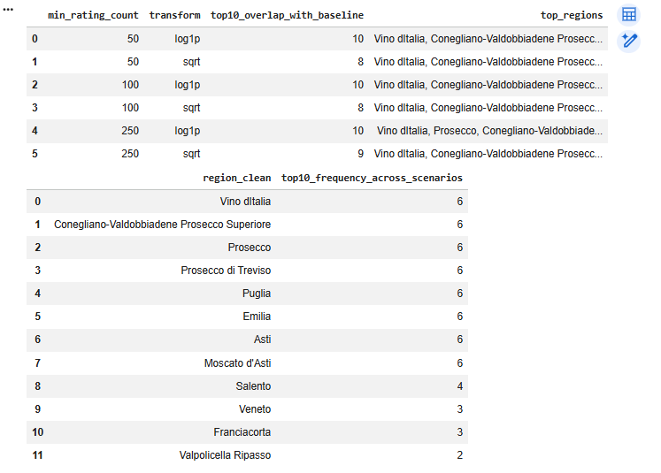

# Slurpini Wine Producer Selection Using Vivino Consumer Data

## Business Analytics and Data Science Project for Wine Region and Producer Pre-Selection

**Author:** Mahdi Dadgar
**Project Type:** Business Analytics / Data Science / Data Cleaning / Exploratory Data Analysis / Scoring Model
**Domain:** Wine Import / Consumer Review Analytics / Market Selection
**Business Use Case:** Data-driven pre-selection of promising Italian wine regions and producer candidates for potential collaboration

---

## 1. Project Overview

Slurpini is an importer of high-quality Italian wines with a strong focus on sustainability. The company receives collaboration requests from wine producers across Italy and needs a more objective way to decide which regions or producers are worth further investigation.

Visiting producers in person requires time, budget, and operational effort. This project uses Vivino consumer review data from the Dutch market to support a more structured first-stage screening process.

The goal is to identify promising Italian wine regions and producer candidates based on:

* consumer rating;
* rating volume;
* price;
* value for money;
* regional reliability;
* strategic business fit.

The final output is a transparent decision-support framework that helps Slurpini prioritize where to focus further producer research.

A full PDF version of the executed notebook is available in `reports/full_project_report.pdf`.
---

## 2. Business Problem

Slurpini needs to make better pre-selection decisions before investing in producer visits or partnership discussions.

The central business question is:

> Which Italian wine regions and producer candidates show the strongest potential based on consumer ratings, popularity, price, value for money, and commercial relevance in the Dutch market?

This project does not aim to make automatic final partnership decisions. Instead, it provides a structured evidence-based shortlist that can be followed by sustainability checks, tastings, supplier conversations, and commercial due diligence.

---

## 3. Dataset

The project uses an Excel workbook exported from Vivino. The dataset contains wines rated by consumers in the Netherlands.

Main fields used:

| Field          | Description                       |
| -------------- | --------------------------------- |
| `name`         | Wine name and vintage information |
| `country`      | Country of origin                 |
| `region`       | Wine region                       |
| `rating`       | Average Vivino consumer rating    |
| `rating_count` | Number of consumer ratings        |
| `price`        | Listed wine price                 |

The original workbook was not analysis-ready. Each Excel sheet contained CSV-like text rows stored in one column, so the data first had to be parsed into a structured dataframe.

### Raw data note

The raw Vivino Excel export is not included in this public repository because dataset sharing rights may be restricted. The notebook expects the raw file locally at:

```text
data/raw/Vivino-export.xlsx
```

Processed output files are generated by running the notebook.

---

## 4. Project Workflow

The project follows an end-to-end data analytics workflow:

1. Business problem definition
2. Workbook inspection
3. Raw data parsing
4. Data quality assessment
5. Data cleaning and text correction
6. Wine-level aggregation
7. Italian wine subset creation
8. Exploratory data analysis
9. Price outlier policy and impact check
10. Value-for-money analysis
11. Sensitivity analysis
12. Regional opportunity scoring
13. Producer-candidate extraction
14. Final shortlist creation
15. Business recommendations
16. Limitations and responsible use of data

---

## 5. Data Cleaning and Preparation

The raw workbook required significant cleaning before analysis.

Main cleaning steps:

* parsed multi-sheet Excel workbook into a structured dataframe;
* removed exact duplicate rows;
* cleaned tuple-like country and region values;
* fixed visible text encoding issues;
* aggregated repeated observations into wine-level records;
* filtered the dataset to Italian wines;
* exported cleaned datasets for reproducibility.

Key data preparation results:

| Metric                                  |   Value |
| --------------------------------------- | ------: |
| Parsed raw rows                         | 409,777 |
| Exact duplicate rows                    | 222,522 |
| Rows after duplicate removal            | 187,255 |
| Unique wine-level records               |  14,088 |
| Final Italian wine records              |   2,986 |
| Italian regions                         |     179 |
| Missing values in final Italian dataset |       0 |
| Remaining visible encoding artifacts    |       0 |

---

## 6. Portfolio-Ready Improvements

This project was improved beyond the original bootcamp submission based on mentor feedback.

Additional portfolio-quality improvements include:

* formal data quality control log;
* explicit price outlier policy;
* before/after outlier impact check;
* value metric sensitivity analysis;
* scoring-weight robustness check;
* deeper analytical layer using correlation and price-band analysis;
* producer-candidate extraction from wine names;
* final top producer-candidate shortlist;
* clearer business recommendation tables;
* more reproducible project structure using `src/` helper modules.

These improvements make the project more defensible, reproducible, and aligned with real-world business analytics expectations.

---

## 7. Analytical Approach

### Exploratory Data Analysis

The EDA focused on:

* rating distribution;
* rating count distribution;
* price distribution;
* regional representation;
* most represented Italian wine regions;
* high-rating regions;
* value-oriented regions.

### Value-for-Money Analysis

The value-for-money logic combines:

* rating quality;
* rating count as a proxy for consumer validation;
* median price.

The analysis uses a weighted value score to avoid relying only on cheap prices or small rating differences.

### Price Outlier Policy

Because value metrics divide by price, extreme prices can distort rankings. The project therefore includes:

* price tail inspection;
* percentile-based outlier review;
* before/after ranking comparison;
* overlap analysis to test ranking stability.

### Sensitivity Analysis

To test robustness, the project compares results under different assumptions, including:

* different minimum rating-count thresholds;
* different rating-count transformations;
* alternative scoring-weight scenarios.

This helps distinguish robust opportunities from borderline rankings.

---

## 8. Region Opportunity Scoring Model

A transparent region opportunity scoring model was created to compare Italian wine regions.

The model combines five components:

| Component                 | Business Meaning                        |
| ------------------------- | --------------------------------------- |
| Quality score             | Average consumer rating                 |
| Popularity score          | Median rating count                     |
| Value-for-money score     | Rating and popularity relative to price |
| Reliability score         | Number of wines in the region           |
| Price accessibility score | More commercially accessible pricing    |

The model is designed as a decision-support tool, not as an automatic decision system.

---

## 9. Producer-Candidate Shortlist

Because the dataset does not contain a clean separate producer column, producer candidates were extracted from wine names using a conservative heuristic.

The producer-candidate shortlist is intended as a first-stage screening output. It should be manually validated before business use.

The shortlist includes:

* producer candidate;
* region;
* representative wine;
* rating;
* rating count;
* median price;
* price band;
* shortlist justification.

This directly supports the business goal of producer pre-selection.

---

## 10. Selected Project Outputs

### Region Opportunity Scores

The region opportunity scoring model compares Italian wine regions using quality, popularity, value for money, reliability, and price accessibility.



### Producer-Candidate Shortlist

The producer-candidate shortlist translates the analysis into a concrete first-stage business deliverable for Slurpini.



### Value Metric Sensitivity Analysis

The value metric sensitivity analysis checks whether top value-for-money regions remain stable under different rating-count thresholds and transformations.



## 11. Key Insights

Key findings from the analysis:

1. **Rating alone is not enough.**
   Italian wine ratings are relatively compressed around 4.0, so small rating differences should not be overinterpreted.

2. **Rating count improves reliability.**
   Wines and regions with many ratings provide stronger evidence of consumer validation than wines with very limited feedback.

3. **Premium and value opportunities are different.**
   Premium regions often show strong ratings but higher prices, while value-oriented regions offer stronger commercial accessibility.

4. **A portfolio strategy is more useful than selecting one region.**
   Slurpini should combine premium, value-for-money, and high-visibility opportunities.

5. **Vivino data supports pre-selection, not final partnership decisions.**
   Final decisions should include sustainability, supplier reliability, logistics, margins, tastings, and brand fit.

---

## 12. Business Recommendations
The main recommendation is that Slurpini should use a portfolio-based selection strategy.

Recommended opportunity groups:

### Premium quality opportunities

Suitable for high-end restaurants, wine bars, and premium brand positioning.

Examples include regions with strong quality signals and premium market positioning.

### Value-for-money opportunities

Suitable for accessible commercial growth, direct-to-consumer offers, and hospitality clients looking for attractive quality at manageable prices.

### High-visibility opportunities

Suitable for market recognition and stable portfolio coverage, especially where regions have strong consumer visibility and sufficient data volume.

### Producer-candidate shortlist

Use the producer-candidate shortlist as a first-stage screening tool, followed by:

* manual producer validation;
* sustainability certification checks;
* tasting sessions;
* supplier conversations;
* logistics and margin review;
* brand-fit assessment.

---

## 13. Limitations and Responsible Use
Important limitations:

* Vivino users may not represent the full Dutch wine market.
* Rating count is a proxy for consumer visibility, not actual sales.
* Listed prices may not reflect wholesale prices, import costs, or margins.
* The dataset does not include sustainability or organic certification.
* Producer names are heuristically extracted from wine names and require manual validation.
* Scoring weights are business assumptions and should be reviewed with stakeholders.
* The model should support human judgment, not replace it.

---

## 14. Repository Structure

```text
slurpini-vivino-producer-selection/
│
├── data/
│   ├── README.md
│   ├── raw/
│   │   └── Vivino-export.xlsx              # Not included publicly
│   │
│   └── processed/
│       ├── data_quality_log.csv
│       ├── price_outlier_impact_summary.csv
│       ├── producer_candidate_shortlist.csv
│       ├── region_opportunity_scores.csv
│       ├── region_scoring_sensitivity_summary.csv
│       ├── strategic_region_summary.csv
│       └── value_metric_sensitivity_summary.csv
│
├── images/
│   ├── producer_candidate_shortlist.png
│   ├── region_opportunity_scores.png
│   └── value_metric_sensitivity.png
│
├── notebooks/
│   └── slurpini-vivino-producer-selection.ipynb
│
├── reports/
│   ├── full_project_report.pdf
│   └── project_overview.md
│
├── src/
│   ├── __init__.py
│   ├── config.py
│   ├── features.py
│   └── vivino_io.py
│
├── README.md
├── requirements.txt
└── .gitignore
```
---

## 15. Tools and Libraries

Main tools:

* Python
* Pandas
* NumPy
* Matplotlib
* Seaborn
* Google Colab
* Jupyter Notebook

Supporting files:

* `src/config.py` for project paths;
* `src/vivino_io.py` for parsing and cleaning;
* `src/features.py` for feature engineering, scoring, and producer extraction;
* `requirements.txt` for reproducibility.

---

## 16. How to Run the Project

1. Clone or download the repository.
2. Place the raw Vivino Excel file locally at:

```text
data/raw/Vivino-export.xlsx
```

3. Install required packages:

```bash
pip install -r requirements.txt
```

4. Open and run the notebook:

```text
notebooks/slurpini_vivino_producer_selection.ipynb
```

5. The notebook exports processed outputs to:

```text
data/processed/
```

---

## 17. Final Conclusion

This project demonstrates how messy real-world consumer review data can be transformed into a structured decision-support framework.

The final solution helps Slurpini move from intuition-based producer exploration toward a more transparent, evidence-based pre-selection process.

The project combines data cleaning, exploratory analysis, value-for-money evaluation, robustness checks, region scoring, producer-candidate extraction, business recommendations, and responsible-use limitations.

The main business value is not only the final ranking, but the creation of a repeatable analytical workflow that Slurpini can reuse and improve over time.

## Repository Purpose

This repository is intended primarily as a **documentation of the analysis and results**, not as a fully reproducible data package.

It includes the notebook, report, and aggregated output tables/figures so the work can be reviewed end-to-end.

The original Vivino export used for the analysis is **not redistributed here** due to potential restrictions on automated collection and redistribution.

Data was sourced from Vivino; automated access and redistribution may be restricted by Vivino’s terms. This repository includes only aggregated summary outputs for demonstration; raw and wine-level datasets are not redistributed.
